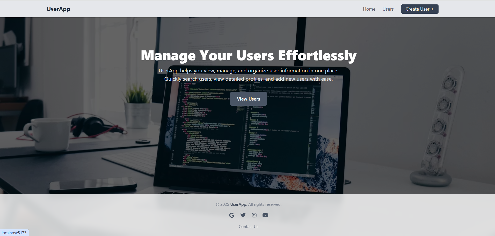
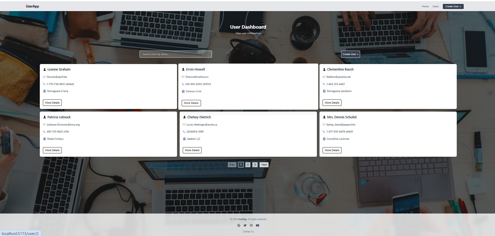
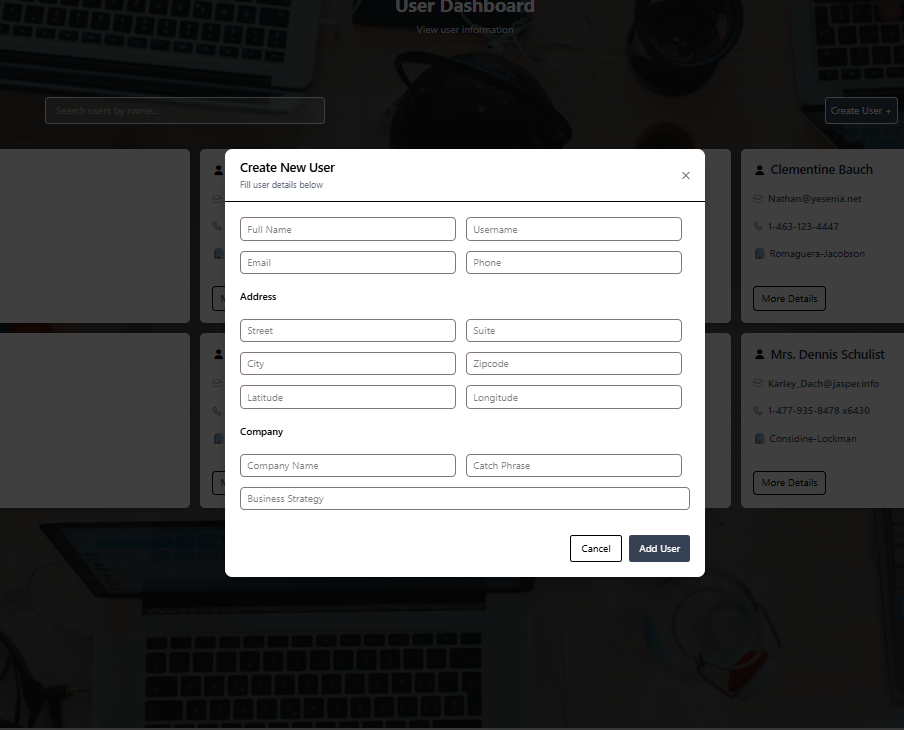
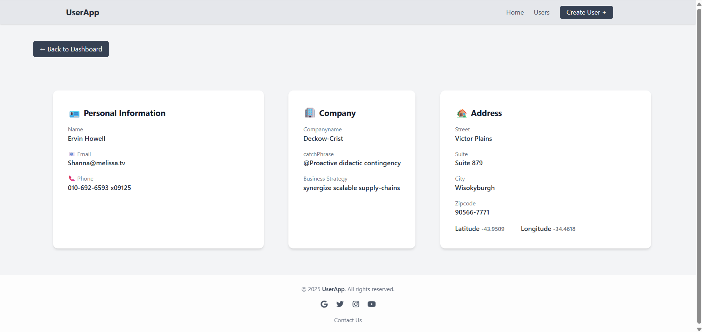
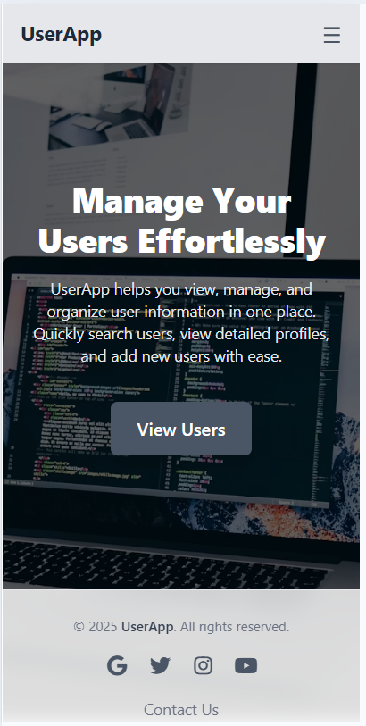
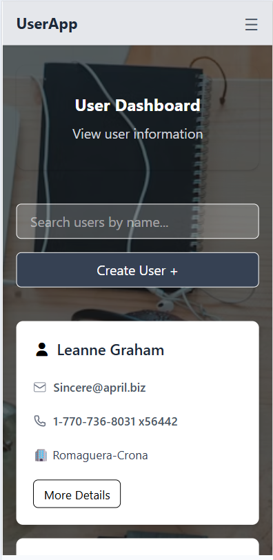
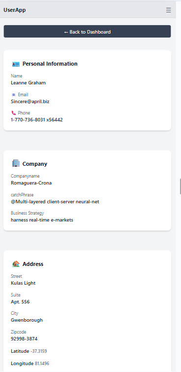

# UserApp - User Management System

A modern, responsive React-based web application for managing and viewing user information. UserApp allows you to view user details, search for users, add new users, and manage user profiles with an intuitive interface.

---

##  Features

- **User Dashboard**: View all users in a  paginated, card-based layout
- **User Search**: Filter users by name in real-time
- **User Details Page**: View comprehensive information about individual users
- **Create Users**: Add new users with validation and local storage persistence
- **Responsive Design**: Fully responsive UI that adapts to mobile, tablet, and desktop screens
- **Dynamic Pagination**: Automatically adjusts pagination based on screen size
- **Local Storage**: Users created locally are persisted in browser storage
- **Toast Notifications**: User-friendly notifications for user actions
- **Modern UI**: Built with Tailwind CSS for a clean, professional appearance

---

##  Screenshots

### Home Page


### Users Dashboard


### Create User Modal


### User Details Page


### Mobile view Home


### Mobile View Dashboard

### Mobile View User Details


---


## Technology Stack

### Frontend Framework & Tools
- **React 19.2.0**: Modern UI library with hooks support
- **React Router 7.11.0**: Client-side routing for navigation
- **Vite 7.2.4**: Fast build tool and development server
- **Tailwind CSS 4.1.18**: Utility-first CSS framework for styling
- **ESLint**: Code quality and style enforcement

### Libraries & Dependencies
- **React Router DOM 7.11.0**: DOM-specific routing components
- **React Toastify 11.0.5**: Toast notifications system
- **FontAwesome 7.1.0**: Icon library for UI elements

---

## Project Structure

```
forty4tech/
├── src/
│   ├── components/
│   │   ├── Addressdetails.jsx          # Address information display component
│   │   ├── Companydetails.jsx          # Company information display component
│   │   ├── CreateUserModal.jsx         # Modal form for creating new users
│   │   ├── detailscard.jsx             # Main user listing card with search & pagination
│   │   ├── footer.jsx                  # Footer component
│   │   ├── home.jsx                    # Landing/home page
│   │   ├── navbar.jsx                  # Navigation bar
│   │   ├── PageNotFound.jsx            # 404 error page
│   │   ├── Personaldetails.jsx         # Personal information display component
│   │   ├── UserCard.jsx                # Individual user card component
│   │   ├── userdetailspage.jsx         # Detailed user profile page
│   │   └── Userslist.jsx               # Users listing page wrapper
│   ├── Context/
│   │   └── useContext.jsx              # Global state management with Context API
│   ├── App.jsx                         # Main app component with routing
│   ├── main.jsx                        # Application entry point
│   ├── App.css                         # App-level styles
│   └── index.css                       # Global styles
├── public/                             # Static assets
├── index.html                          # HTML entry point
├── package.json                        # Project dependencies & scripts
├── vite.config.js                      # Vite configuration
├── eslint.config.js                    # ESLint configuration
└── README.md                           # This file
```

---

## Getting Started


1. **Clone the repository** (or navigate to the project directory)
   ```bash
   cd forty4tech
   ```

2. **Install dependencies**
   ```bash
   npm install
   ```

3. **Start the development server**
   ```bash
   npm run dev
   ```
   The application will be available at `http://localhost:5173` (or the port specified by Vite)

### Building for Production

```bash
npm run build
```
This creates an optimized production build in the `dist/` directory.

### Preview Production Build

```bash
npm run preview
```

---


### Home Page
- Landing page with introduction to UserApp
- "View Users" button to navigate to the user dashboard

### Users Dashboard (`/users`)
- **Search Bar**: Search users by name in real-time
- **Create User Button**: Opens a modal to add new users
- **User Cards**: Display user information in a grid layout
- **Pagination**: Navigate through multiple pages of users (3 cards/mobile, 6 cards/desktop)

### User Details Page (`/user/:id`)
- View comprehensive information about a specific user
- Displays:
  - Personal Details (name, username, email, phone, website)
  - Address Information (street, city, zipcode, coordinates)
  - Company Information (company name, catchphrase, business focus)

### Create User Modal
- **Form Fields**:
  - Name (required)
  - Username (required)
  - Email (required, validated)
  - Phone (required, validated)
  - City (required)
  - Latitude (optional, numeric)
  - Longitude (optional, numeric)
- **Validation**: Real-time error messages for invalid inputs
- **Local Storage**: New users are saved to browser local storage
- **Notifications**: Success/error toast messages on submission

---


## Component Details

### Context API (useContext.jsx)
**Purpose**: Global state management for the entire application

**State Management**:
- `users`: Array of all users (from API + local storage)
- `openModal`: Boolean to toggle user creation modal
- `page`: Current pagination page number
- `limit`: Number of users per page
- `loading`: Loading state for UI transitions

**Key Functions**:
- `Apicall()`: Fetches users from JSONPlaceholder API
- `getLocalUser()`: Retrieves users from local storage
- `addUser()`: Adds new user to state and local storage
- Dynamic pagination limits based on window size (3 for mobile, 6 for desktop)

### Key Components

#### Home Component
- Hero section with app description
- Call-to-action button linking to users list
- Background image with overlay

#### Detailscard Component
- User search functionality
- User creation button
- Pagination controls
- Responsive grid layout

#### UserCard Component
- Individual user card display
- Shows basic user information
- Link to detailed user profile page

#### CreateUserModal Component
- Modal form with validation
- Error handling and display
- Toast notifications on success/failure
- Form data persisted to local storage

#### Navbar & Footer
- Navigation across pages
- Footer with branding/information

---

## Data Flow

1. **Initialization**: 
   - App loads JSONPlaceholder API data
   - Merges with any locally stored users
   - Displays combined list

2. **Search**: 
   - User enters search term
   - Filters users by name
   - Updates pagination

3. **Pagination**: 
   - Adjusts limit based on screen size
   - Displays subset of filtered users
   - Shows navigation controls

4. **Create User**: 
   - User fills form in modal
   - Validation checks input
   - New user added to state and local storage
   - Modal closes, success notification shown

5. **View Details**: 
   - Click user card
   - Navigate to detail page
   - Fetch and display full user information

---

## Styling

- **Framework**: Tailwind CSS v4.1.18
- **Responsive Design**: Mobile-first approach with breakpoints
  - `sm`: 640px (tablet)
  - `lg`: 1024px (desktop)
- **Color Scheme**:
  - Dark overlays for background images
  - White/gray cards on dark backgrounds
  - Blue accents for interactive elements
- **Icons**: FontAwesome 7.1.0 for UI icons

---

## Responsive Breakpoints

| Screen Size | Pagination Limit | Layout |
|------------|------------------|--------|
| Mobile (< 640px) | 3 users | Single column |
| Tablet (640px - 1024px) | 6 users | 2-column grid |
| Desktop (> 1024px) | 6 users | 3-column grid |

---

## Local Storage

The application uses browser local storage to persist user-created data:

**Key**: `users`
**Value**: JSON array of user objects

Whenever a new user is created, it's automatically saved to local storage and merged with API data on app reload.

---

##  API Integration

### JSONPlaceholder API
- **Endpoint**: `https://jsonplaceholder.typicode.com/users`
- **Usage**: Fetches mock user data on app initialization


---

## Notes

- Users created in the application are stored in local storage and persist across browser sessions
- API data is fetched once on app initialization
- The application automatically detects window resizing and adjusts pagination accordingly
- Toast notifications provide user feedback for all major actions

---


**Project Name**: UserApp
